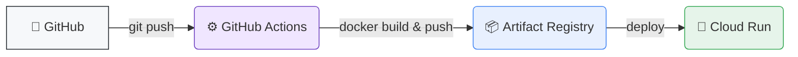
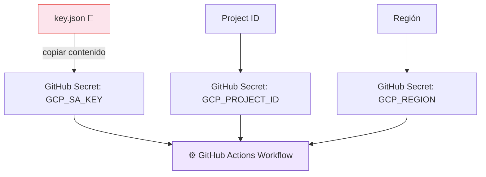
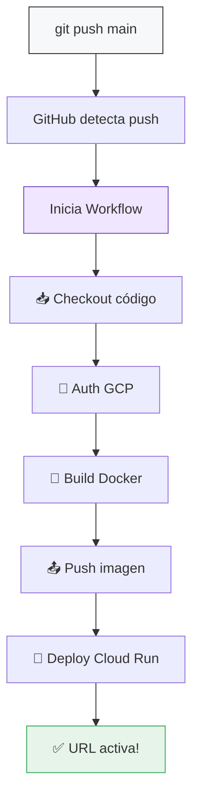

# 🔄 CI/CD: Deploy Automático a Cloud Run

Guía completa para desplegar automáticamente tu aplicación en **Cloud Run** con cada `git push`.  
Cubrimos **dos métodos**: GitHub Actions (recomendado) y Cloud Build directo.

---

## 💡 ¿Qué vamos a lograr?

Cada vez que hagas `git push` a `main`, tu app se construye y despliega automáticamente.



> [!TIP] ¿Por qué GitHub Actions en vez de Cloud Build?
> *   **Control total**: El workflow vive en tu repo (`.github/workflows/`).
> *   **Ecosistema**: Miles de Actions reutilizables en el marketplace.
> *   **Portabilidad**: No dependes 100% de GCP para el CI.
> *   **Gratis**: 2,000 min/mes en repos públicos, 500 min en privados (free tier).

---

## 📋 Requisitos Previos

- [ ] Cuenta de **GitHub** con tu código en un repositorio.
- [ ] Cuenta de **Google Cloud** con proyecto creado y **facturación activa**.
- [ ] **`gcloud` CLI** instalada en tu máquina ([instrucciones](https://cloud.google.com/sdk/docs/install)).
- [ ] Tu proyecto tiene un **`Dockerfile`** en la raíz.

> [!NOTE] Estructura Mínima del Repo
> ```text
> 📁 mi-repositorio/
> ├── 📄 Dockerfile               ← Requerido
> ├── 📄 .github/
> │   └── workflows/
> │       └── deploy.yml          ← Lo crearemos
> ├── 📄 package.json             ← O requirements.txt
> └── 📁 src/
> ```

---

# 🅰️ Método 1: GitHub Actions (Recomendado)

---

## Paso 1: Preparar Google Cloud (una sola vez)

Estos comandos los ejecutas en tu **terminal local** con `gcloud` autenticado.

### 1.1 Autenticarte y seleccionar proyecto

```bash
# Iniciar sesión en Google Cloud
gcloud auth login

# Listar tus proyectos existentes
gcloud projects list

# Seleccionar tu proyecto (reemplaza con tu ID)
gcloud config set project TU-PROJECT-ID

# Verificar qué proyecto tienes seleccionado
gcloud config get-value project
```

> [!IMPORTANT] ¿Qué es el Project ID?
> Es el identificador único de tu proyecto en GCP. Lo encuentras en:
> **Console** → Dashboard → cuadro superior izquierdo.
> Ejemplo: `mi-app-produccion-123456`
> **No** es lo mismo que el **nombre** del proyecto.

### 1.2 Habilitar las APIs necesarias

```bash
# Habilitar las 3 APIs que necesitamos (una sola vez por proyecto)
gcloud services enable \
  run.googleapis.com \
  artifactregistry.googleapis.com \
  iam.googleapis.com
```

| API | ¿Para qué sirve? |
| :--- | :--- |
| `run.googleapis.com` | Servicio Cloud Run (donde corre tu app). |
| `artifactregistry.googleapis.com` | Registro de imágenes Docker en GCP. |
| `iam.googleapis.com` | Gestión de permisos y cuentas de servicio. |

### 1.3 Crear repositorio en Artifact Registry

Artifact Registry es donde se guardarán las imágenes Docker que GitHub Actions construya.

```bash
# Crear un repositorio Docker en Artifact Registry
gcloud artifacts repositories create docker-repo \
  --repository-format=docker \
  --location=us-central1 \
  --description="Imágenes Docker para Cloud Run"
```

> [!TIP] Verifica que se creó
> ```bash
> gcloud artifacts repositories list --location=us-central1
> ```
> Deberías ver `docker-repo` en la lista.

### 1.4 Crear una Cuenta de Servicio para GitHub Actions

Esta cuenta es la "identidad" que GitHub Actions usará para interactuar con GCP.

```bash
# Crear la cuenta de servicio
gcloud iam service-accounts create github-actions-deployer \
  --display-name="GitHub Actions Deployer" \
  --description="Cuenta para CI/CD desde GitHub Actions"
```

Verifica que se creó:
```bash
gcloud iam service-accounts list
```

Deberías ver algo como:
```text
EMAIL                                                        DISABLED
github-actions-deployer@TU-PROJECT-ID.iam.gserviceaccount.com  False
```

> [!NOTE] El email de la cuenta de servicio
> Tiene el formato: `NOMBRE@TU-PROJECT-ID.iam.gserviceaccount.com`
> Este email lo usaremos en los siguientes pasos. Guárdalo.

### 1.5 Asignar permisos (roles) a la cuenta de servicio

La cuenta necesita permisos para: subir imágenes, desplegar en Cloud Run y actuar como otra cuenta.

```bash
# Variable para no repetir (reemplaza TU-PROJECT-ID)
export PROJECT_ID="TU-PROJECT-ID"
export SA_EMAIL="github-actions-deployer@${PROJECT_ID}.iam.gserviceaccount.com"

# 1. Permiso para subir imágenes a Artifact Registry
gcloud projects add-iam-policy-binding $PROJECT_ID \
  --member="serviceAccount:${SA_EMAIL}" \
  --role="roles/artifactregistry.writer"

# 2. Permiso para administrar Cloud Run
gcloud projects add-iam-policy-binding $PROJECT_ID \
  --member="serviceAccount:${SA_EMAIL}" \
  --role="roles/run.admin"

# 3. Permiso para actuar como cuenta de servicio (necesario para deploy)
gcloud projects add-iam-policy-binding $PROJECT_ID \
  --member="serviceAccount:${SA_EMAIL}" \
  --role="roles/iam.serviceAccountUser"
```

| Rol | ¿Qué permite? |
| :--- | :--- |
| `roles/artifactregistry.writer` | Subir (push) imágenes Docker al registro. |
| `roles/run.admin` | Crear/actualizar/eliminar servicios en Cloud Run. |
| `roles/iam.serviceAccountUser` | Permite "actuar como" otra cuenta de servicio (Cloud Run necesita esto para desplegarse). |

### 1.6 Crear y descargar la clave JSON

GitHub Actions necesita esta clave para autenticarse como la cuenta de servicio.

```bash
# Generar la clave y guardarla en un archivo local
gcloud iam service-accounts keys create key.json \
  --iam-account=$SA_EMAIL
```

> [!CAUTION] 🔐 Seguridad de la clave
> *   El archivo `key.json` contiene acceso completo a tu proyecto con los roles asignados.
> *   **NUNCA** subas este archivo a Git. Agrégalo a `.gitignore`.
> *   Lo usaremos solo para copiarlo a GitHub Secrets (siguiente paso).
> *   Después de configurar el secret, puedes **eliminar** el archivo local.

---

## Paso 2: Configurar GitHub Secrets

Los secrets son variables cifradas en GitHub. Tu workflow las leerá sin exponerlas.

### 2.1 Obtener el contenido de la clave

```bash
# Copiar el contenido al portapapeles (macOS)
cat key.json | pbcopy

# En Linux:
cat key.json | xclip -selection clipboard

# O simplemente ver el contenido y copiarlo manualmente
cat key.json
```

### 2.2 Agregar secrets en GitHub

1. Ve a tu repositorio en GitHub.
2. Haz clic en **Settings** (⚙️) → En el menú izquierdo: **Secrets and variables** → **Actions**.
3. Haz clic en **"New repository secret"**.

Agrega **estos 3 secrets** (uno por uno):

| Nombre del Secret | Valor |
| :--- | :--- |
| `GCP_SA_KEY` | El contenido **completo** del archivo `key.json` (JSON entero). |
| `GCP_PROJECT_ID` | Tu Project ID (ej. `mi-app-produccion-123456`). |
| `GCP_REGION` | La región (ej. `us-central1`). |

> [!WARNING] Verifica los nombres
> Los nombres de los secrets deben coincidir **exactamente** con los que usarás en el archivo `deploy.yml`. Son **case-sensitive**.



### 2.3 Limpiar la clave local

```bash
# Eliminar la clave local (ya está segura en GitHub Secrets)
rm key.json
```

---

## Paso 3: Crear el Workflow de GitHub Actions

Este es el archivo que define **qué pasa** cuando haces `git push`.

### 3.1 Crear la estructura de carpetas

```bash
# Desde la raíz de tu proyecto
mkdir -p .github/workflows
```

### 3.2 Crear el archivo `deploy.yml`

Crea el archivo `.github/workflows/deploy.yml` con este contenido:

```yaml
# ============================================================
# 🚀 CI/CD: Deploy automático a Cloud Run
# Se ejecuta con cada push a la rama 'main'
# ============================================================

name: 🚀 Deploy to Cloud Run

# ┌─────────────────────────────────────────────────────┐
# │ ¿CUÁNDO se ejecuta este workflow?                   │
# └─────────────────────────────────────────────────────┘
on:
  push:
    branches:
      - main       # Solo cuando haces push a main

# ┌─────────────────────────────────────────────────────┐
# │ VARIABLES globales del workflow                      │
# └─────────────────────────────────────────────────────┘
env:
  SERVICE_NAME: mi-app                 # Nombre de tu servicio en Cloud Run
  IMAGE_NAME: mi-app                   # Nombre de la imagen Docker
  REPO_NAME: docker-repo              # Nombre del repo en Artifact Registry

# ┌─────────────────────────────────────────────────────┐
# │ JOBS: Los pasos que se ejecutan                      │
# └─────────────────────────────────────────────────────┘
jobs:
  deploy:
    name: 🏗️ Build & Deploy
    runs-on: ubuntu-latest

    steps:
      # ── 1. Obtener el código del repo ──
      - name: 📥 Checkout código
        uses: actions/checkout@v4

      # ── 2. Autenticarse en Google Cloud ──
      - name: 🔐 Autenticación en GCP
        uses: google-github-actions/auth@v2
        with:
          credentials_json: ${{ secrets.GCP_SA_KEY }}

      # ── 3. Configurar gcloud CLI ──
      - name: ⚙️ Configurar gcloud
        uses: google-github-actions/setup-gcloud@v2
        with:
          project_id: ${{ secrets.GCP_PROJECT_ID }}

      # ── 4. Configurar Docker para usar Artifact Registry ──
      - name: 🐳 Configurar Docker con Artifact Registry
        run: |
          gcloud auth configure-docker ${{ secrets.GCP_REGION }}-docker.pkg.dev --quiet

      # ── 5. Construir la imagen Docker ──
      - name: 🔨 Build imagen Docker
        run: |
          docker build -t ${{ secrets.GCP_REGION }}-docker.pkg.dev/${{ secrets.GCP_PROJECT_ID }}/${{ env.REPO_NAME }}/${{ env.IMAGE_NAME }}:${{ github.sha }} .
          docker tag ${{ secrets.GCP_REGION }}-docker.pkg.dev/${{ secrets.GCP_PROJECT_ID }}/${{ env.REPO_NAME }}/${{ env.IMAGE_NAME }}:${{ github.sha }} ${{ secrets.GCP_REGION }}-docker.pkg.dev/${{ secrets.GCP_PROJECT_ID }}/${{ env.REPO_NAME }}/${{ env.IMAGE_NAME }}:latest

      # ── 6. Subir imagen a Artifact Registry ──
      - name: 📤 Push imagen a Artifact Registry
        run: |
          docker push ${{ secrets.GCP_REGION }}-docker.pkg.dev/${{ secrets.GCP_PROJECT_ID }}/${{ env.REPO_NAME }}/${{ env.IMAGE_NAME }}:${{ github.sha }}
          docker push ${{ secrets.GCP_REGION }}-docker.pkg.dev/${{ secrets.GCP_PROJECT_ID }}/${{ env.REPO_NAME }}/${{ env.IMAGE_NAME }}:latest

      # ── 7. Desplegar en Cloud Run ──
      - name: 🚀 Deploy a Cloud Run
        uses: google-github-actions/deploy-cloudrun@v2
        with:
          service: ${{ env.SERVICE_NAME }}
          image: ${{ secrets.GCP_REGION }}-docker.pkg.dev/${{ secrets.GCP_PROJECT_ID }}/${{ env.REPO_NAME }}/${{ env.IMAGE_NAME }}:${{ github.sha }}
          region: ${{ secrets.GCP_REGION }}
          flags: >-
            --allow-unauthenticated
            --port=8080
            --memory=512Mi
            --cpu=1
            --min-instances=0
            --max-instances=3

      # ── 8. Mostrar la URL del servicio ──
      - name: 🌐 Mostrar URL
        run: |
          echo "✅ Desplegado exitosamente!"
          echo "🔗 URL: $(gcloud run services describe ${{ env.SERVICE_NAME }} --region=${{ secrets.GCP_REGION }} --format='value(status.url)')"
```

> [!IMPORTANT] Personaliza estas variables
> En la sección `env:` del archivo, cambia:
> *   `SERVICE_NAME`: El nombre que tendrá tu servicio en Cloud Run.
> *   `IMAGE_NAME`: El nombre de la imagen Docker.
> *   `REPO_NAME`: Debe coincidir con el nombre del repo de Artifact Registry creado en el Paso 1.3.

### 3.3 Personalización de flags de Cloud Run

En el step de deploy, puedes ajustar los flags según tu app:

| Flag | Descripción | Valores comunes |
| :--- | :--- | :--- |
| `--port` | Puerto donde escucha tu app | `8080`, `3000`, `5000` |
| `--memory` | RAM asignada | `256Mi`, `512Mi`, `1Gi`, `2Gi` |
| `--cpu` | CPUs asignadas | `1`, `2`, `4` |
| `--min-instances` | Instancias mínimas (0 = ahorro) | `0`, `1` |
| `--max-instances` | Máximo de instancias | `3`, `10`, `100` |
| `--allow-unauthenticated` | Permite acceso público (web) | Quitar si es API privada |
| `--set-env-vars` | Variables de entorno | `KEY=value,KEY2=value2` |

> [!TIP] Variables de entorno en el deploy
> Si tu app necesita variables de entorno (como `DATABASE_URL`), agrégalas como secrets en GitHub y pásalas así:
> ```yaml
> flags: >-
>   --allow-unauthenticated
>   --set-env-vars=DATABASE_URL=${{ secrets.DATABASE_URL }},API_KEY=${{ secrets.API_KEY }}
> ```

---

## Paso 4: ¡Hacer el primer deploy!

```bash
# 1. Asegúrate de estar en la rama main
git checkout main

# 2. Agrega los archivos nuevos
git add .github/workflows/deploy.yml

# 3. Commit
git commit -m "🚀 Agrega workflow CI/CD con GitHub Actions"

# 4. Push — ¡Esto dispara el deploy automático!
git push origin main
```

### 4.1 Ver el progreso del deploy

1. Ve a tu repositorio en GitHub.
2. Haz clic en la pestaña **"Actions"** (▶️).
3. Verás tu workflow ejecutándose. Haz clic para ver los logs en tiempo real.



---

## Paso 5: Verificar el deploy

```bash
# Ver servicios desplegados en Cloud Run
gcloud run services list

# Obtener la URL de tu servicio
gcloud run services describe mi-app \
  --region=us-central1 \
  --format='value(status.url)'

# Ver logs del servicio
gcloud run services logs read mi-app --region=us-central1 --limit=50
```

---

## ⚙️ Workflow Avanzado: Con Tests y Notificaciones

Si quieres correr tests antes de desplegar y recibir notificación:

```yaml
name: 🚀 Deploy to Cloud Run (con tests)

on:
  push:
    branches: [main]
  pull_request:
    branches: [main]    # Corre tests en PRs también

env:
  SERVICE_NAME: mi-app
  IMAGE_NAME: mi-app
  REPO_NAME: docker-repo

jobs:
  # ── JOB 1: Correr Tests ──
  test:
    name: 🧪 Tests
    runs-on: ubuntu-latest
    steps:
      - uses: actions/checkout@v4
      
      - name: Setup Node.js       # O Python, etc.
        uses: actions/setup-node@v4
        with:
          node-version: '20'
      
      - name: Instalar dependencias
        run: npm ci
      
      - name: Correr tests
        run: npm test

  # ── JOB 2: Deploy (solo si tests pasan Y es push a main) ──
  deploy:
    name: 🏗️ Build & Deploy
    needs: test                        # Espera que tests pasen
    if: github.event_name == 'push'    # Solo en push, no en PRs
    runs-on: ubuntu-latest
    
    steps:
      - uses: actions/checkout@v4

      - uses: google-github-actions/auth@v2
        with:
          credentials_json: ${{ secrets.GCP_SA_KEY }}

      - uses: google-github-actions/setup-gcloud@v2
        with:
          project_id: ${{ secrets.GCP_PROJECT_ID }}

      - name: 🐳 Configurar Docker
        run: gcloud auth configure-docker ${{ secrets.GCP_REGION }}-docker.pkg.dev --quiet

      - name: 🔨 Build & Push
        run: |
          IMAGE="${{ secrets.GCP_REGION }}-docker.pkg.dev/${{ secrets.GCP_PROJECT_ID }}/${{ env.REPO_NAME }}/${{ env.IMAGE_NAME }}:${{ github.sha }}"
          docker build -t $IMAGE .
          docker push $IMAGE

      - name: 🚀 Deploy
        uses: google-github-actions/deploy-cloudrun@v2
        with:
          service: ${{ env.SERVICE_NAME }}
          image: ${{ secrets.GCP_REGION }}-docker.pkg.dev/${{ secrets.GCP_PROJECT_ID }}/${{ env.REPO_NAME }}/${{ env.IMAGE_NAME }}:${{ github.sha }}
          region: ${{ secrets.GCP_REGION }}
          flags: >-
            --allow-unauthenticated
            --port=8080
            --memory=512Mi
```

> [!NOTE] Flujo del workflow avanzado
> ```text
> Pull Request a main → Solo corre Tests (no despliega)
> Push a main         → Corre Tests → Si pasan → Despliega
> ```

---

## 🔄 Rollback: Volver a una versión anterior

Si algo sale mal con un deploy, puedes volver atrás rápidamente:

### Opción 1: Desde la consola de GCP

1. Ve a [console.cloud.google.com/run](https://console.cloud.google.com/run).
2. Haz clic en tu servicio.
3. Pestaña **"Revisiones"** → Selecciona la revisión anterior → **"Dirigir tráfico"**.

### Opción 2: Con gcloud CLI

```bash
# Ver las revisiones disponibles
gcloud run revisions list --service=mi-app --region=us-central1

# Redirigir tráfico a una revisión específica
gcloud run services update-traffic mi-app \
  --region=us-central1 \
  --to-revisions=mi-app-REVISION-ANTERIOR=100
```

### Opción 3: Re-deploy desde GitHub

```bash
# Revertir el commit problemático
git revert HEAD
git push origin main
# GitHub Actions desplegará automáticamente la versión anterior
```

---

# 🅱️ Método 2: Cloud Build (Alternativa desde la Consola de GCP)

> [!NOTE] ¿Cuándo usar este método?
> Si prefieres configurar todo de la consola de GCP sin tocar archivos YAML.
> Cloud Build se conecta directamente a tu repo de GitHub.

---

## 1. Crear Servicio en Cloud Run

1.  Ve a la consola: [console.cloud.google.com/run](https://console.cloud.google.com/run)
2.  Haz clic en **"CREAR SERVICIO"**.

---

## 2. Seleccionar Origen (GitHub)

En la sección "Origen del contenedor", selecciona la segunda opción:
*   🔘 **Configurar con implementación continua desde un repositorio de código fuente**

Haz clic en el botón: **[ CONFIGURAR CON CLOUD BUILD ]**

---

## 3. Conectar y Seleccionar Repositorio

Se abrirá el panel lateral de Cloud Build:
1.  **Proveedor**: Selecciona **GitHub**.
2.  **Autenticar**: Conecta tu cuenta (instala la app de Google Cloud Build si es la primera vez).
3.  **Repositorio**: Elige tu repo (`tu-usuario/tu-proyecto`).
4.  **Rama**: Escribe `^main$` para desplegar solo cuando hagas push a la rama `main`.

> [!WARNING] Patrones de Rama
> *   `^main$`: Solo rama main (Exacto).
> *   `.*`: Cualquier rama (¡Cuidado! Desplegará features en desarrollo).

---

## 4. Configuración de Build

Elige cómo construir tu app:

| Opción | Descripción | Recomendado si... |
| :--- | :--- | :--- |
| **Dockerfile** | Usa tu propio archivo Docker. | ✅ Tienes un `Dockerfile` personalizado. |
| **Buildpacks** | Google detecta el lenguaje. | ❌ No sabes usar Docker (Node, Python, Go, Java). |

*Ubicación Dockerfile*: `/Dockerfile` (si está en la raíz).

---

## 5. Configurar el Servicio

Define las propiedades de ejecución en Cloud Run:

*   **Nombre del servicio**: `mi-app-web`
*   **Región**: `us-central1` (o la más cercana).
*   **Autenticación**:
    *   🔘 **Permitir invocaciones no autenticadas** (Para webs públicas).
    *   🔘 **Requerir autenticación** (Para APIs privadas).

### Configuraciones Opcionales (Expandir sección)
*   **Variables de Entorno**: `DATABASE_URL`, `API_KEY`, etc.
*   **Memoria/CPU**: Ajusta según necesites (ej. 512MiB, 1 CPU).
*   **Instancias Mínimas**:
    *   `0`: Ahorro máximo (puede tardar unos segundos en arrancar).
    *   `1`: Respuesta inmediata (costo continuo).

---

## 6. Crear y Desplegar

1.  Haz clic en **"CREAR"**.
2.  Espera unos minutos. Cloud Build iniciará el primer despliegue automáticamente.

> [!TIP] Ver Progreso
> Puedes ir a **Cloud Build → Historial** para ver los logs en tiempo real.

---

# 📊 Comparación de Métodos

| Característica | 🅰️ GitHub Actions | 🅱️ Cloud Build |
| :--- | :--- | :--- |
| **Configuración** | Archivo YAML en tu repo | Desde consola de GCP |
| **Control** | Total (tú defines cada paso) | Limitado (GCP maneja el build) |
| **Tests pre-deploy** | ✅ Fácil de agregar | ⚠️ Requiere `cloudbuild.yaml` |
| **Costo** | Gratis (free tier generoso) | ~$0.003/min de build |
| **Portabilidad** | Alta (no dependes de GCP para CI) | Baja (todo en GCP) |
| **Visibilidad** | Pestaña Actions en GitHub | Consola de Cloud Build |
| **Recomendado para** | Proyectos con equipo/tests | Deploys rápidos y simples |

---

# 🧪 Probar que Funciona

Independiente del método que elijas:

```bash
# 1. Haz un cambio visible en tu código (ej: cambia un texto en tu app)
# 2. Commit y Push
git add .
git commit -m "✨ Probando deploy automático"
git push origin main

# 3. Espera 2-5 minutos
# 4. Visita tu URL de Cloud Run → ¡Deberías ver el cambio!
```

---

# 🔧 Solución de Problemas

| Problema | Método | Solución |
| :--- | :--- | :--- |
| **Workflow no se ejecuta** | Actions | Verifica que el archivo esté en `.github/workflows/` y la rama sea `main`. |
| **Error de autenticación GCP** | Actions | Revisa que `GCP_SA_KEY` contenga el JSON completo (con llaves `{}`). |
| **Permission denied** | Ambos | La cuenta de servicio necesita los 3 roles: `artifactregistry.writer`, `run.admin`, `iam.serviceAccountUser`. |
| **Build falla** | Ambos | Revisa los logs. Error común: ruta del Dockerfile incorrecta o dependencias faltantes. |
| **Error 502/503** | Ambos | Tu app no arranca en el puerto correcto. Usa `process.env.PORT` o `os.environ.get("PORT", 8080)`. |
| **No veo mis repos** | Build | Reinstala la app de GitHub Cloud Build en el repo. |
| **Timeout en build** | Actions | La imagen es muy grande. Optimiza el Dockerfile con multi-stage builds. |
| **Imagen no se encuentra** | Actions | Verifica que `REPO_NAME` en el YAML coincida con el repo de Artifact Registry. |

---

## 📄 Dockerfile de Ejemplo (Node.js)

```dockerfile
# ── Build stage ──
FROM node:20-alpine AS builder
WORKDIR /app
COPY package*.json ./
RUN npm ci --only=production

# ── Production stage ──
FROM node:20-alpine
WORKDIR /app
COPY --from=builder /app/node_modules ./node_modules
COPY . .

# Cloud Run usa la variable PORT
ENV PORT=8080
EXPOSE 8080

CMD ["node", "src/index.js"]
```

## 📄 Dockerfile de Ejemplo (Python/Flask)

```dockerfile
FROM python:3.12-slim

WORKDIR /app
COPY requirements.txt .
RUN pip install --no-cache-dir -r requirements.txt

COPY . .

# Cloud Run inyecta la variable PORT
ENV PORT=8080
EXPOSE 8080

CMD ["gunicorn", "--bind", "0.0.0.0:8080", "app:app"]
```

> [!IMPORTANT] El puerto es clave
> Cloud Run **inyecta** la variable de entorno `PORT`. Tu app debe escuchar en ese puerto.
> ```javascript
> // Node.js
> const PORT = process.env.PORT || 8080;
> app.listen(PORT);
> ```
> ```python
> # Python
> port = int(os.environ.get("PORT", 8080))
> app.run(host="0.0.0.0", port=port)
> ```
