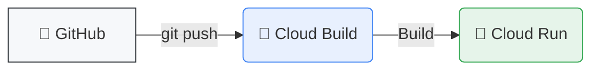

# 🔄 CI/CD: Cloud Run + GitHub

Guía para configurar un pipeline de despliegue automático: con cada `git push` tu aplicación se despliega en **Cloud Run**.

---

## 💡 ¿Qué vamos a lograr?

Configurar un pipeline donde GitHub notifica a Cloud Build, y este construye y despliega en Cloud Run.



> [!TIP] Beneficios
> *   **Automatización Total**: Olvídate de desplegar manualmente.
> *   **Historial**: Trazabilidad completa de qué commit generó qué versión.
> *   **Rollback**: Vuelve a una versión anterior fácilmente desde la consola.

---

## 📋 Requisitos Previos

- [ ] Cuenta de GitHub con tu código en un repositorio.
- [ ] Cuenta de Google Cloud con proyecto creado y facturación activa.
- [ ] Tu proyecto tiene un `Dockerfile` en la raíz (recomendado).

> [!NOTE] Estructura Mínima del Repo
> ```text
> 📁 mi-repositorio/
> ├── 📄 Dockerfile        ← Requerido
> ├── 📄 package.json     ← O requirements.txt
> └── 📁 src/
> ```

---

## 1. Crear Servicio en Cloud Run

1.  Ve a la consola: [console.cloud.google.com/run](https://console.cloud.google.com/run)
2.  Haz clic en **"CREAR SERVICIO"**.

---

## 2. Seleccionar Origen (GitHub)

En la sección "Origen del contenedor", selecciona la segunda opción:
*   🔘 **Configurar con implementación continua desde un repositorio de código fuente**

Haz clic en el botón: **[ CONFIGURAR CON CLOUD BUILD ]**

---

## 3. Conectar y Seleccionar Repositorio

Se abrirá el panel lateral de Cloud Build:
1.  **Proveedor**: Selecciona **GitHub**.
2.  **Autenticar**: Conecta tu cuenta (instala la app de Google Cloud Build si es la primera vez).
3.  **Repositorio**: Elige tu repo (`tu-usuario/tu-proyecto`).
4.  **Rama**: Escribe `^main$` para desplegar solo cuando hagas push a la rama `main`.

> [!WARNING] Patrones de Rama
> *   `^main$`: Solo rama main (Exacto).
> *   `.*`: Cualquier rama (¡Cuidado! Desplegará features en desarrollo).

---

## 4. Configuración de Build

Elige cómo construir tu app:

| Opción | Descripción | Recomendado si... |
| :--- | :--- | :--- |
| **Dockerfile** | Usa tu propio archivo Docker. | ✅ Tienes un `Dockerfile` personalizado. |
| **Buildpacks** | Google detecta el lenguaje. | ❌ No sabes usar Docker (Node, Python, Go, Java). |

*Ubicación Dockerfile*: `/Dockerfile` (si está en la raíz).

---

## 5. Configurar el Servicio

Define las propiedades de ejecución en Cloud Run:

*   **Nombre del servicio**: `mi-app-web`
*   **Región**: `us-central1` (o la más cercana).
*   **Autenticación**:
    *   🔘 **Permitir invocaciones no autenticadas** (Para webs públicas).
    *   🔘 **Requerir autenticación** (Para APIs privadas).

### Configuraciones Opcionales (Expandir sección)
*   **Variables de Entorno**: `DATABASE_URL`, `API_KEY`, etc.
*   **Memoria/CPU**: Ajusta según necesites (ej. 512MiB, 1 CPU).
*   **Instancias Mínimas**:
    *   `0`: Ahorro máximo (puede tardar unos segundos en arrancar el primer request).
    *   `1`: Respuesta inmediata (costo continuo).

---

## 6. Crear y Desplegar

1.  Haz clic en **"CREAR"**.
2.  Espera unos minutos. Cloud Build iniciará el primer despliegue automáticamente.

> [!INFO] Ver Progreso
> Puedes ir a **Cloud Build > Historial** para ver los logs en tiempo real.

---

## 🧪 Cómo Probar

Simplemente haz un cambio en tu código y súbelo:

```bash
# 1. Haz un cambio en tu código
# 2. Commit y Push
git add .
git commit -m "Probando CI/CD automático"
git push origin main
```

¡En unos minutos tu cambio estará vivo en producción! 🚀

---

## ⚙️ Configuración Avanzada (cloudbuild.yaml)

Si necesitas pasos complejos (tests, compilación frontend), crea un archivo `cloudbuild.yaml` en tu repo:

```yaml
steps:
  # 1. Build
  - name: 'gcr.io/cloud-builders/docker'
    args: ['build', '-t', 'gcr.io/$PROJECT_ID/mi-app:$COMMIT_SHA', '.']

  # 2. Push
  - name: 'gcr.io/cloud-builders/docker'
    args: ['push', 'gcr.io/$PROJECT_ID/mi-app:$COMMIT_SHA']

  # 3. Deploy
  - name: 'gcr.io/google.com/cloudsdktool/cloud-sdk'
    entrypoint: gcloud
    args:
      - 'run'
      - 'deploy'
      - 'mi-app'
      - '--image'
      - 'gcr.io/$PROJECT_ID/mi-app:$COMMIT_SHA'
      - '--region'
      - 'us-central1'
      - '--allow-unauthenticated'
images:
  - 'gcr.io/$PROJECT_ID/mi-app:$COMMIT_SHA'
```

---

## 🔧 Solución de Problemas

| Problema | Posible Solución |
| :--- | :--- |
| **No veo mis repos** | Reinstala la app de GitHub en el repo específico o todos. |
| **Build falla** | Revisa los logs en Cloud Build. Error común: ruta del Dockerfile. |
| **Error 502** | Tu app no escucha en el puerto correcto. Usa `process.env.PORT`. |
| **Permission denied** | La cuenta de servicio de Cloud Build necesita el rol "Cloud Run Admin". |
