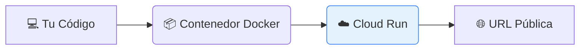

# ☁️ Guía Completa de Google Cloud Run

Despliega tu proyecto web paso a paso en contenedores serverless.

---

## 1. ¿Qué es Cloud Run?

Cloud Run es un servicio de Google Cloud que ejecuta tus aplicaciones en contenedores. Tú solo subes tu código y Google se encarga de todo lo demás.



> [!TIP] Ventajas de Cloud Run
> *   **Escalado automático**: Sube y baja según el tráfico (incluso a 0 para no gastar).
> *   **Pago por uso**: Solo pagas cuando tu código se está ejecutando.
> *   **HTTPS automático**: Certificados SSL gestionados por Google.
> *   **Serverless**: No necesitas administrar servidores ni parches.

> [!INFO] ¿Qué necesitas?
> *   Una cuenta de Google Cloud (con facturación habilitada).
> *   Tu proyecto web funcionando localmente.
> *   Un archivo `Dockerfile` (instrucciones abajo).

---

## 2. Crear cuenta en Google Cloud

*   **URL**: [console.cloud.google.com](https://console.cloud.google.com)

**Pasos:**
1.  Ve a la consola e inicia sesión con Google.
2.  Acepta los términos y agrega una tarjeta para verificación (no cobran sin permiso).
3.  **Crear Proyecto**: Clic en el selector superior → "Nuevo Proyecto" → Nombre: `mi-proyecto-web`.

> [!TIP] Capa Gratuita
> *   $300 USD de crédito gratis por 90 días.
> *   Cloud Run ofrece **2 millones de solicitudes gratis al mes**.

---

## 3. Preparar tu proyecto

Tu proyecto debe tener una estructura compatible con contenedores.

**Estructura Típica:**
```text
📁 mi-proyecto/
├── 📄 Dockerfile          ← Instrucciones para el contenedor
├── 📄 package.json        ← Dependencias (Node.js)
├── 📄 requirements.txt    ← Dependencias (Python)
├── 📁 src/                ← Código fuente
└── 📁 public/             ← Archivos estáticos
```

> [!WARNING] Importante
> Tu aplicación debe escuchar en el puerto definido por la variable de entorno `PORT`. Cloud Run inyecta esta variable (usualmente 8080).

**Ejemplo Node.js (Express):**
```javascript
const express = require('express');
const app = express();

app.get('/', (req, res) => res.send('¡Hola Cloud Run!'));

// ⚠️ IMPORTANTE: Usar process.env.PORT
const PORT = process.env.PORT || 8080;
app.listen(PORT, () => console.log(`Servidor en puerto ${PORT}`));
```

**Ejemplo Python (Flask):**
```python
import os
from flask import Flask
app = Flask(__name__)

@app.route('/')
def hello(): return '¡Hola Cloud Run!'

if __name__ == '__main__':
    # ⚠️ IMPORTANTE: Usar PORT del entorno
    port = int(os.environ.get('PORT', 8080))
    app.run(host='0.0.0.0', port=port)
```

---

## 4. Crear el Dockerfile

El `Dockerfile` contiene las instrucciones para "empaquetar" tu app.

### Node.js
```dockerfile
FROM node:18-slim
WORKDIR /app
COPY package*.json ./
RUN npm install --production
COPY . .
EXPOSE 8080
CMD ["node", "src/index.js"]
```

### Python
```dockerfile
FROM python:3.11-slim
WORKDIR /app
COPY requirements.txt .
RUN pip install --no-cache-dir -r requirements.txt
COPY . .
EXPOSE 8080
CMD ["python", "app.py"]
```

> [!TIP] .dockerignore
> Crea un archivo `.dockerignore` para no copiar basura al contenedor:
> ```text
> node_modules
> .git
> .env
> Dockerfile
> ```

---

## 5. Instalar Google Cloud CLI

Para desplegar desde la terminal, necesitas el SDK.
*   **Descarga**: [cloud.google.com/sdk/docs/install](https://cloud.google.com/sdk/docs/install)
*   **Mac (Homebrew)**: `brew install google-cloud-sdk`

**Configuración Inicial:**
```bash
# 1. Login
gcloud auth login

# 2. Seleccionar proyecto
gcloud config set project [PROJECT-ID]

# 3. Configurar región (ej. us-central1)
gcloud config set run/region us-central1

# 4. Habilitar APIs
gcloud services enable run.googleapis.com cloudbuild.googleapis.com
```

---

## 6. Desplegar a Cloud Run

### 🚀 Método Recomendado: Despliegue desde código
Cloud Run construye la imagen y la despliega en un solo paso.

```bash
gcloud run deploy mi-servicio \
  --source . \
  --allow-unauthenticated
```
*   `mi-servicio`: El nombre que quieras darle.
*   `--source .`: Usa el código de la carpeta actual.
*   `--allow-unauthenticated`: Hace que la URL sea pública para todo el mundo.

**Resultado Exitoso:**
```text
Service [mi-servicio] has been deployed and is serving 100 percent of traffic.
Service URL: https://mi-servicio-xyz123-uc.a.run.app
```

---

## 7. Configuración Adicional

Puedes ajustar el comando de deploy con flags extra:

**Variables de Entorno:**
```bash
gcloud run deploy mi-servicio --source . \
  --set-env-vars="DATABASE_URL=xxx,API_KEY=yyy"
```

**Memoria y CPU:**
```bash
gcloud run deploy mi-servicio --source . \
  --memory=512Mi --cpu=1
```

**Ver Logs:**
```bash
# En tiempo real
gcloud run services logs read mi-servicio --follow
```

---

## 8. Actualizar tu aplicación

Cada vez que hagas cambios en el código, simplemente **vuelve a ejecutar el comando de deploy**:

```bash
gcloud run deploy mi-servicio --source .
```

Cloud Run creará una nueva **Revisión** y moverá el tráfico a la nueva versión automáticamente.

---

## 📋 Comandos Útiles

| Acción | Comando |
| :--- | :--- |
| **Listar servicios** | `gcloud run services list` |
| **Ver detalles** | `gcloud run services describe mi-servicio` |
| **Eliminar** | `gcloud run services delete mi-servicio` |
| **Ver revisiones** | `gcloud run revisions list` |
| **Cambiar región** | `gcloud config set run/region REGION` |

---

## 🔧 Solución de Problemas

| Error | Solución |
| :--- | :--- |
| **Container failed to start** | Verifica que tu app escuche en `process.env.PORT` y no en un puerto fijo. |
| **Build failed** | Revisa el `Dockerfile` y que `package.json`/`requirements.txt` estén correctos. |
| **Permission denied** | Ejecuta `gcloud auth login` nuevamente. |
| **Billing not enabled** | Activa la facturación en la consola de Google Cloud. |
| **App lenta al inicio** | Configura `--min-instances 1` para evitar "cold starts" (tiene costo). |

---

## ✅ Checklist Final

- [ ] Cuenta de Google Cloud creada y proyecto configurado.
- [ ] App configurada para usar el puerto `PORT`.
- [ ] `Dockerfile` y `.dockerignore` creados.
- [ ] Google Cloud CLI instalado y autenticado.
- [ ] APIs habilitadas (`run`, `cloudbuild`).
- [ ] Despliegue exitoso con `gcloud run deploy`.
- [ ] App accesible públicamente en la URL generada.
