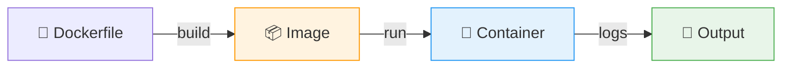

# 🐳 Cheat Sheet: Docker

Guía rápida para dominar contenedores e imágenes.

---

## 1. Conceptos Fundamentales

Docker empaqueta tu app y sus cosas para que corra igual en todos lados.



---

## 2. Gestión de Imágenes (Build)

La "receta" de tu aplicación.

```bash
# Construir imagen con tag
docker build -t mi-app:v1 .

# Construir especificando archivo
docker build -f Dockerfile.dev -t mi-app:dev .
```

| Comando | Acción |
| :--- | :--- |
| `docker images` | Listar imágenes locales. |
| `docker pull ` | Descargar imagen (ej. `python:3.9`). |
| `docker rmi <id>` | Eliminar imagen. |
| `docker image prune` | 🧹 Limpiar imágenes "sueltas" (dangling). |

---

## 3. Gestión de Contenedores (Run)

Tus imágenes en ejecución.

> [!TIP] El comando mágico
> ```bash
> docker run -d -p 8080:80 --name mi-web nginx
> ```
> *   `-d`: Detached (segundo plano).
> *   `-p`: Puerto `Host:Contenedor`.
> *   `--name`: Nombre fácil de recordar.

### Estado y Control
| Acción | Comando |
| :--- | :--- |
| **Listar Activos** | `docker ps` |
| **Listar Todos** | `docker ps -a` |
| **Detener** | `docker stop <nombre>` |
| **Iniciar** | `docker start <nombre>` |
| **Entrar (Shell)** | `docker exec -it <nombre> bash` |
| **Ver Logs** | `docker logs -f <nombre>` |

> [!WARNING] Borrar todo
> Eliminar todos los contenedores detenidos y en ejecución (¡Cuidado!):
> ```bash
> docker rm -f $(docker ps -aq)
> ```

---

## 4. Volúmenes y Persistencia

Si el contenedor muere, los datos mueren... ¡a menos que uses volúmenes!

```bash
# Volumen nombrado (Persistente, gestionado por Docker)
docker run -v mi-data:/var/lib/mysql mysql

# Bind Mount (Carpeta local específica)
docker run -v $(pwd)/src:/app/src node
```

*   `docker volume ls`: Listar volúmenes.
*   `docker volume create`: Crear uno manualmente.
*   `docker volume prune`: Borrar volúmenes no usados (⚠️ destructivo).

---

## 5. Redes (Networking)

Conectar contenedores entre sí por nombre.

```bash
docker network create mi-red
docker run --network mi-red --name db mysql
docker run --network mi-red --name api mi-app
# Ahora 'api' puede conectarse a 'db' usando el host "db"
```

---

## 6. Docker Compose 🐙

Orquestar múltiples contenedores (La forma profesional de desarrollar).

**Ejemplo `docker-compose.yml`:**
```yaml
version: '3.8'
services:
  web:
    build: .
    ports: ["3000:3000"]
    depends_on: [db]
  db:
    image: postgres:15
    volumes: [postgres_data:/var/lib/postgresql/data]

volumes:
  postgres_data:
```

### Comandos Compose
| Comando | Acción |
| :--- | :--- |
| `docker-compose up -d` | Levantar todo en segundo plano. |
| `docker-compose down` | Apagar y borrar contenedores/redes. |
| `docker-compose logs -f` | Ver logs de todos los servicios. |
| `docker-compose build` | Reconstruir imágenes si cambió el código. |

---

## 7. Limpieza Profunda 🧹

Cuando tu disco se llena...

> [!DANGER] Zona de Peligro
> **Docker System Prune** borra:
> 1.  Contenedores detenidos
> 2.  Redes no usadas
> 3.  Imágenes "dangling" (sin nombre)
> 4.  Caché de construcción
>
> ```bash
> docker system prune -a --volumes
> ```

---

## 8. Debugging

Herramientas para cuando las cosas fallan.

*   `docker inspect <id>`: Ver toda la metadata (IP, volúmenes, env vars) en JSON.
*   `docker stats`: Monitor de recursos (CPU/RAM) en tiempo real.
*   `docker history <imagen>`: Ver las capas y comandos que formaron la imagen.
