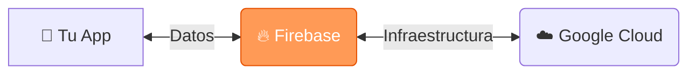
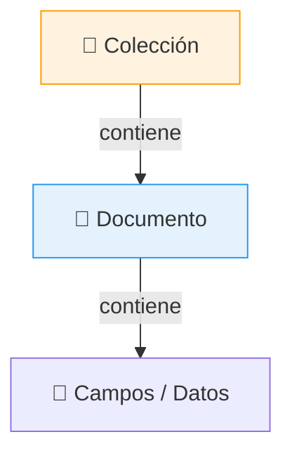

# 🔥 Guía Completa de Firebase

Guía paso a paso para crear tu primera base de datos con **Firestore**.

---

## 1. ¿Qué es Firebase?

Firebase es una plataforma de Google que te permite crear aplicaciones sin preocuparte por servidores. Es tu "backend listo para usar".



> [!TIP] ¿Por qué Firebase?
> *   **No necesitas configurar servidores**
> *   Es gratis para empezar (Spark Plan)
> *   Escala automáticamente con tu app

---

## 2. Crear cuenta y acceder

*   **URL de la consola:** [console.firebase.google.com](https://console.firebase.google.com/)

**Pasos:**
1.  Ve a la URL indicada.
2.  Haz clic en **"Iniciar sesión con Google"**.
3.  Usa tu cuenta de Gmail.

> [!WARNING] Requisito
> Necesitas una cuenta de Google (Gmail). Es gratis.

---

## 3. Crear un nuevo proyecto

1.  En la consola, haz clic en **"Crear proyecto"** o **"Agregar proyecto"**.
2.  Escribe un nombre para tu proyecto (ej: `mi-tienda-online`).
3.  Decide si quieres Google Analytics (opcional, recomendado desactivar para pruebas rápidas).
4.  Haz clic en **"Crear proyecto"** y espera ~30 segundos.

> [!TIP] Nombres recomendados
> *   Usa minúsculas: `mi-app` ✅
> *   Usa guiones: `app-de-tareas` ✅
> *   Evita espacios: `Mi App` ❌

---

## 4. Crear la base de datos (Firestore)

1.  En el menú izquierdo, busca **"Compilación"** (Build).
2.  Haz clic en **"Firestore Database"**.
3.  Haz clic en **"Crear base de datos"**.
4.  **Ubicación**: Elige la región más cercana (ej. `us-central1`). *No se puede cambiar después.*
5.  **Reglas de Seguridad**:

| Modo | Descripción | ¿Cuándo usarlo? |
| :--- | :--- | :--- |
| **🧪 Test mode** | Abierto 30 días. Cualquiera lee/escribe. | Para aprender y desarrollar. |
| **🔒 Production** | Bloqueado por defecto. Requiere reglas. | Apps en producción. |

> [!IMPORTANT] Importante
> Si eliges "Test mode", después de 30 días la base de datos se bloqueará automáticamente si no actualizas las reglas.

---

## 5. Estructura de datos

Firestore es una base de datos NoSQL orientada a documentos.



### Ejemplo Práctico: App de Tareas

**📁 Colección: `usuarios`**
> **📄 usuario_001**
> *   `nombre`: "Juan"
> *   `email`: "juan@mail.com"

> **📄 usuario_002**
> *   `nombre`: "María"
> *   `email`: "maria@mail.com"

**📁 Colección: `tareas`**
> **📄 tarea_001**
> *   `titulo`: "Comprar leche"
> *   `completada`: false
> *   `userId`: "usuario_001"

---

## 6. Conectar Firebase con tu código

### 6.1 Registrar tu aplicación
1.  En la consola, ve a **Configuración del proyecto** (⚙️).
2.  Baja hasta **"Tus apps"**.
3.  Haz clic en el ícono Web `</>`.
4.  Copia la configuración (`firebaseConfig`).

### 6.2 Instalación
```bash
npm install firebase
```

### 6.3 Configuración Inicial (`firebase.js`)

```javascript
import { initializeApp } from "firebase/app";
import { getFirestore } from "firebase/firestore";

// Tu configuración de la consola
const firebaseConfig = {
  apiKey: "AIzaSy...",
  authDomain: "tu-app.firebaseapp.com",
  projectId: "tu-app",
  storageBucket: "tu-app.appspot.com",
  messagingSenderId: "123456789",
  appId: "1:123:web:abc123"
};

const app = initializeApp(firebaseConfig);
export const db = getFirestore(app);
```

### 6.4 Operaciones Básicas (CRUD)

```javascript
import { collection, addDoc, getDocs } from "firebase/firestore";
import { db } from "./firebase";

// CREAR - Agregar documento (ID automático)
await addDoc(collection(db, "tareas"), {
  titulo: "Mi primera tarea",
  completada: false
});

// LEER - Obtener todos los documentos
const querySnapshot = await getDocs(collection(db, "tareas"));
querySnapshot.forEach((doc) => {
  console.log(doc.id, " => ", doc.data());
});
```

---

## ✅ Checklist Final

- [ ] Creé mi cuenta en Firebase con Google.
- [ ] Creé un nuevo proyecto y la base de datos Firestore.
- [ ] Elegí el modo de seguridad adecuado.
- [ ] Registré mi app Web y copié la configuración.
- [ ] Instalé el paquete `firebase` y conecté mi código.
- [ ] Ejecuté mi primera escritura/lectura con éxito.

---
*Más información en la [Documentación Oficial](https://firebase.google.com/docs).*
