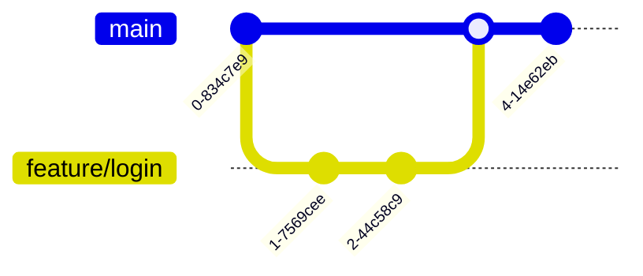

# 🐙 Guía Completa de Git + GitHub

Control de versiones desde cero

---

## 💡 ¿Qué es Git?

Git es un sistema de **control de versiones**. Imagina que es como un "historial de cambios" muy poderoso para tu código.

| ❌ Sin Git | ✅ Con Git |
| :--- | :--- |
| proyecto_final.zip<br>proyecto_final_v2.zip<br>proyecto_FINAL_REAL.zip<br>proyecto_AHORA_SI.zip<br>proyecto_backup_mayo.zip | 📁 proyecto/<br>└── Todo el historial guardado automáticamente con mensajes descriptivos |

> [!TIP] 💡 Git vs GitHub
> *   **Git** = Herramienta en tu computadora
> *   **GitHub** = Sitio web para guardar tu código en la nube y colaborar

---

## 📚 Conceptos clave

### Las 4 áreas de Git


| Término | ¿Qué es? |
| :--- | :--- |
| **Repository (Repo)** | Tu proyecto con todo su historial de cambios |
| **Commit** | Una "foto" de tu código en un momento específico |
| **Branch (Rama)** | Una línea paralela de desarrollo |
| **Merge** | Unir dos ramas |
| **Clone** | Copiar un repo de GitHub a tu máquina |
| **Pull** | Traer cambios de GitHub a tu máquina |
| **Push** | Enviar tus commits a GitHub |

---

## 1. Instalar Git

| Sistema | Cómo instalar |
| :--- | :--- |
| **Windows** | Descarga de `git-scm.com` → Ejecuta el instalador |
| **macOS** | `brew install git` o instala Xcode Command Line Tools |
| **Linux (Ubuntu)** | `sudo apt install git` |

**Verificar instalación:**
```bash
git --version
# Output: git version 2.43.0
```

---

## 2. Configuración inicial (solo una vez)

Configura tu nombre y email (aparecerán en tus commits):

```bash
# Tu nombre
git config --global user.name "Tu Nombre"

# Tu email (usa el mismo de GitHub)
git config --global user.email "tu@email.com"

# Verificar configuración
git config --list
```

> [!TIP] 💡 Opcional pero recomendado:
> ```bash
> # Rama por defecto "main" en lugar de "master"
> git config --global init.defaultBranch main
> 
> # Editor por defecto (VS Code)
> git config --global core.editor "code --wait"
> ```

---

## 3. Crear cuenta en GitHub

1.  Ve a **github.com**
2.  Haz clic en **"Sign up"**
3.  Ingresa tu email, crea una contraseña y username
4.  Verifica tu email

> [!INFO] ℹ️ Tu username de GitHub:
> *   Será parte de tu URL: `github.com/tu-username`
> *   Elige algo profesional si lo usarás para trabajo
> *   Se puede cambiar después (pero no es recomendado)

---

## 4. Tu primer repositorio

**Opción A: Empezar un proyecto nuevo desde cero**

```bash
# 1. Crear carpeta del proyecto
mkdir mi-proyecto
cd mi-proyecto

# 2. Inicializar Git
git init
# Output: Initialized empty Git repository in /mi-proyecto/.git/

# 3. Crear un archivo
echo "# Mi Proyecto" > README.md

# 4. Agregar archivos al staging
git add README.md
# O agregar TODO:
git add .

# 5. Hacer tu primer commit
git commit -m "Primer commit"
```

**Opción B: Clonar un repo existente de GitHub**

```bash
# Clonar un repositorio
git clone https://github.com/usuario/nombre-repo.git

# Entrar a la carpeta
cd nombre-repo
```

---

## 5. Conectar con GitHub

**Paso 1: Crear repositorio en GitHub**
1.  Ve a **github.com** → Haz clic en **"+"** → **"New repository"**
2.  Nombre: `mi-proyecto`
3.  Deja las demás opciones por defecto
4.  Haz clic en **"Create repository"**

**Paso 2: Conectar tu repo local con GitHub**

```bash
# Agregar el repositorio remoto
git remote add origin https://github.com/TU-USUARIO/mi-proyecto.git

# Verificar que se agregó
git remote -v

# Subir tu código a GitHub (primera vez)
git push -u origin main
```

> [!WARNING] ⚠️ ¿Te pide usuario/contraseña?
> GitHub ya no acepta contraseñas. Necesitas un **Personal Access Token**:
> 1.  GitHub → Settings → Developer settings → Personal access tokens → Tokens (classic)
> 2.  Generate new token → Selecciona permisos "repo"
> 3.  Copia el token y úsalo como contraseña

---

## 6. Flujo de trabajo diario

Este es el ciclo que repetirás constantemente:

**1. Modificas** → **2. git add** → **3. git commit** → **4. git push**

```bash
# 1. Ver qué archivos cambiaron
git status

# 2. Agregar archivos modificados
git add .                    # Todos los archivos
git add archivo.js           # Un archivo específico

# 3. Crear commit con mensaje descriptivo
git commit -m "Agrega función de login"

# 4. Subir a GitHub
git push

# Extra: Ver historial de commits
git log --oneline
```

> [!TIP] 💡 Buenos mensajes de commit:
> *   ✅ "Agrega validación de email en formulario"
> *   ✅ "Corrige bug de login con espacios"
> *   ✅ "Actualiza dependencias de seguridad"
> *   ❌ "Cambios"
> *   ❌ "asdfasdf"
> *   ❌ "WIP"

---

## 7. Trabajar con ramas (branches)

Las ramas te permiten trabajar en features sin afectar el código principal.

**Visualización de ramas**



```bash
# Ver ramas existentes
git branch

# Crear nueva rama
git branch feature/login

# Cambiar a esa rama
git checkout feature/login

# O crear y cambiar en un solo comando
git checkout -b feature/login

# Trabajar normalmente...
git add .
git commit -m "Implementa formulario de login"

# Subir la rama a GitHub
git push -u origin feature/login

# Volver a main
git checkout main

# Unir los cambios de la rama a main
git merge feature/login

# Eliminar rama (ya no la necesitas)
git branch -d feature/login
```

> [!INFO] ℹ️ Nombres de ramas comunes:
> *   `feature/nombre` → Nueva funcionalidad
> *   `fix/nombre` → Corrección de bug
> *   `hotfix/nombre` → Corrección urgente
> *   `develop` → Rama de desarrollo

---

## 8. Traer cambios de GitHub

Cuando otros (o tú desde otra computadora) hacen cambios:

```bash
# Traer y fusionar cambios de GitHub
git pull

# O separar en dos pasos:
git fetch              # Descarga cambios sin fusionar
git merge origin/main  # Fusiona los cambios
```

> [!WARNING] ⚠️ Buena práctica:
> Siempre haz `git pull` antes de empezar a trabajar para tener la última versión.

---

## 9. Resolver conflictos

Ocurren cuando dos personas modifican la misma línea de código.

```bash
# Git te mostrará algo así en el archivo:
<<<<<<< HEAD
Tu código local
=======
Código de GitHub
>>>>>>> origin/main
```

**Cómo resolverlo:**
1.  Abre el archivo con conflicto
2.  Decide qué código conservar (o combínalos)
3.  Elimina las líneas `<<<`, `===`, `>>>`
4.  Guarda el archivo
5.  Haz commit:

```bash
git add .
git commit -m "Resuelve conflicto en archivo.js"
```

> [!TIP] 💡 VS Code ayuda:
> VS Code detecta conflictos y te muestra botones para aceptar los cambios de un lado u otro.

---

## 10. Deshacer cambios

| Situación | Comando |
| :--- | :--- |
| Descartar cambios en un archivo (no guardado) | `git checkout -- archivo.js` |
| Quitar archivo del staging (después de add) | `git reset archivo.js` |
| Deshacer último commit (mantener cambios) | `git reset --soft HEAD~1` |
| Deshacer último commit (borrar cambios) | `git reset --hard HEAD~1` |
| Crear commit que revierte otro | `git revert <commit-id>` |

> [!CAUTION] 🚨 Cuidado con --hard:
> Borra los cambios permanentemente. Úsalo solo si estás seguro.

---

## 11. Archivo .gitignore

Lista de archivos que Git debe ignorar (no subir a GitHub).

```bash
# Crear archivo .gitignore en la raíz del proyecto

# Dependencias
node_modules/
vendor/
__pycache__/

# Variables de entorno (¡IMPORTANTE!)
.env
.env.local
*.env

# Archivos del sistema
.DS_Store
Thumbs.db

# Logs
*.log
logs/

# Carpetas de build
dist/
build/
.next/

# IDEs
.idea/
.vscode/
```

> [!CAUTION] 🚨 NUNCA subas a GitHub:
> *   Archivos `.env` con claves secretas
> *   API keys, passwords, tokens
> *   Credenciales de base de datos

---

## 📋 Comandos de referencia rápida

| Comando | Descripción |
| :--- | :--- |
| `git init` | Inicializa un repositorio nuevo |
| `git clone URL` | Clona un repositorio de GitHub |
| `git status` | Ver estado de archivos |
| `git add .` | Agregar todos los archivos al staging |
| `git commit -m "msg"` | Crear commit con mensaje |
| `git push` | Subir commits a GitHub |
| `git pull` | Traer cambios de GitHub |
| `git branch` | Listar ramas |
| `git checkout -b nombre` | Crear y cambiar a nueva rama |
| `git merge rama` | Fusionar rama actual con otra |
| `git log --oneline` | Ver historial de commits |
| `git diff` | Ver cambios no guardados |
| `git stash` | Guardar cambios temporalmente |
| `git stash pop` | Recuperar cambios guardados |
| `git remote -v` | Ver repositorios remotos |

---

## ✓ Checklist del principiante

- [ ] Instalé Git en mi computadora
- [ ] Configuré mi nombre y email con git config
- [ ] Creé mi cuenta de GitHub
- [ ] Creé mi primer repositorio local con git init
- [ ] Hice mi primer commit
- [ ] Conecté con GitHub (git remote add)
- [ ] Subí mi código con git push
- [ ] Creé un archivo .gitignore
- [ ] Practiqué crear y fusionar ramas
- [ ] Entiendo el flujo: add → commit → push

---

## 🔧 Errores comunes y soluciones

| Error | Solución |
| :--- | :--- |
| "fatal: not a git repository" | No estás en una carpeta con Git. Usa `git init` o entra a la carpeta correcta |
| "failed to push some refs" | Hay cambios en GitHub que no tienes. Haz `git pull` primero |
| "Permission denied (publickey)" | Configura SSH keys o usa HTTPS con token |
| "Your branch is ahead of origin" | Tienes commits locales sin subir. Haz `git push` |
| "CONFLICT: Merge conflict" | Edita los archivos manualmente y luego `git add` + `git commit` |
| "Changes not staged for commit" | Olvidaste hacer `git add` antes del commit |
